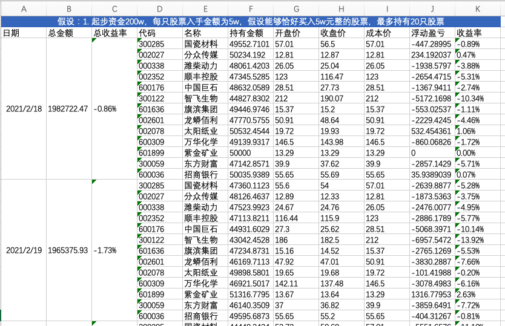
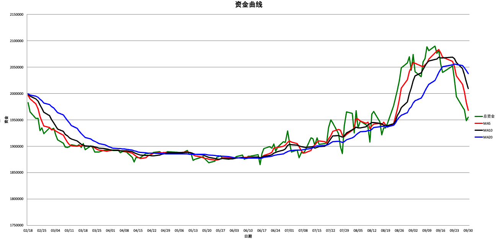

# compound-interest
### 自选股计算器  
统计从 2021/02/18 开始的自选股持仓的收益。

#### **计算逻辑**
**v1.0:**   
假设初始资金200w, 按照时间顺序检测每天的 "复利人生"自选股名单:  
若某股票A从当天的自选股名单中消失, 则按照当天的开盘价卖出持有的股票A;  
若某股票A开始出现在当天的自选股名单中, 则按照当天的开盘价买入5w 元整（假设可以正好买入5w 元）的股票A.  

按照当天的收盘价统计每天的各个持仓股票的收益情况, 以及自选股整体的收益情况.  

**v2.0:**  
加入模拟账户指导实际账户的操作。  

模拟账户按照 v1.0 的逻辑进行操作，并加入总资金值的均线（5日，10日，20日等），模拟账户的当前资金值在20日均线以上，则实际账户和模拟账户保持一致的操作；  
若模拟账户的当前资金值在20日均线以下，则实际账户仓位减为原来的一半。  

模拟账户的信息和实际账户分别按照当天的收盘价统计每天的各个持仓股票的收益情况, 以及自选股整体的收益情况.  并将各自的信息分别保存在不同的excel中。

#### **使用方法**  
1. 依赖安装  
1.1 [安装python 和 pip](https://zhuanlan.zhihu.com/p/38603105)  
1.2 命令行执行`pip install -r requirements.txt`  

2. 数据准备  
收集"复利人生" 从2021/02/18 开始的自选股信息, 将股票号码和股票名称录入到 excel中.  
注意每个月份一个sheet且sheet 名称格式为 YYYY-mm; 每天的股票池需要将日期合并, 且日期格式为 YYYY/mm/dd.   

3. 数据计算  
python replay_stock.py --excel=2021-stocks.xlsx  # （其中 --excel 参数指定使用的excel文件路径）  
结果会生成在原excel中.  

4. 资金曲线展示  
执行完 2.数据计算之后, 资金曲线会自动生成在同名excel的 ProfitHistory sheet中.  
